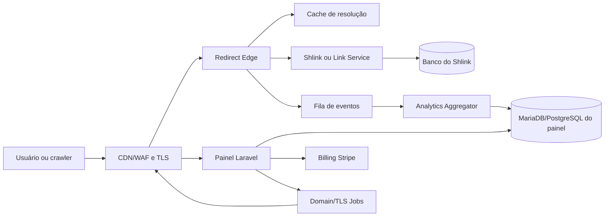

# MElink 10/10 — arquitetura alvo

**Autor:** Manus AI  
**Data:** 26 de agosto de 2026  
**Status:** Especificação de implementação  
**Objetivo:** Evoluir a arquitetura atual para uma plataforma de branded links, campanhas e atribuição com operação segura.

## 1. Decisão arquitetural

A arquitetura deve separar o caminho de redirecionamento do painel de controle. O painel Laravel continua sendo o sistema de gestão, billing, domínios e administração. O Shlink continua sendo o motor de resolução de links quando ele atender ao caso. Uma camada de redirect própria, pequena e observável, deve proteger o tráfego público, aplicar regras simples, registrar eventos mínimos e degradar com segurança.

O princípio é evitar que uma página lenta, webhook, consulta de analytics ou scanner derrube o redirecionamento. O painel pode ficar indisponível por alguns minutos sem transformar links publicados em páginas de erro.

## 2. Componentes e responsabilidades

| Componente | Responsabilidade | Não deve fazer |
|---|---|---|
| CDN/WAF | TLS, cache de assets, mitigação de bots abusivos e proteção de borda | Decidir regras comerciais sem observabilidade |
| Redirect Edge | Resolver host/slug, aplicar regra, emitir redirect e enfileirar evento | Renderizar painel, consultar Stripe ou executar analytics síncrono pesado |
| Shlink | Persistir e resolver links compatíveis com o modelo escolhido | Ser usado como proxy recursivo do próprio painel |
| Painel Laravel | UI, autenticação, links, campanhas, domínios, billing, admin e relatórios | Ser dependência síncrona do redirect público |
| Banco de produto | Usuários, workspaces, links espelho, campanhas, entitlements, eventos agregados e auditoria | Guardar segredos ou dados de clique sem política de retenção |
| Analytics pipeline | Normalizar eventos, deduplicar, agregar e disponibilizar métricas | Bloquear o redirect esperando processamento |
| Domain/TLS worker | Verificar DNS, emitir/renovar certificado e atualizar estado | Expor autorização sem prova de domínio |
| Billing worker | Consumir webhooks, reconciliar assinatura e recalcular entitlements | Confiar em retorno do browser como fonte de pagamento |
| Object storage | Exports, relatórios, assets e backups criptografados | Tornar dados de clientes públicos por default |
| Observabilidade | Métricas, logs estruturados, traces e alertas | Registrar tokens, URLs sensíveis ou PII desnecessária |

## 3. Domínio de dados

### 3.1 Entidades principais

`users` representa identidade individual e nunca deve ser a única fronteira de isolamento quando houver equipes. `workspaces` representa uma organização ou cliente. `workspace_members` liga pessoas a workspaces com papéis. `plans` e `subscriptions` descrevem o contrato de cobrança. `entitlements` materializa limites efetivos para evitar que cada controller replique regras comerciais.

`links` representa o ativo de marketing. Além do slug e destino, deve conter `workspace_id`, `domain_id`, `campaign_id`, estado (`active`, `paused`, `expired`, `deleted`), timestamps, versão de destino e política de fallback. `link_destinations` guarda histórico de edições; nunca sobrescrever o único destino sem trilha.

`campaigns` agrupa links e UTMs. `tracking_templates` define padrões reutilizáveis. `qr_codes` aponta para um link e guarda configuração visual, versão e estado. `routing_rules` contém condições declarativas, prioridade, destino, fallback e auditoria de alteração.

`click_events` deve ser mínimo e anonimizado, com `link_id`, `occurred_at`, país/região aproximados, dispositivo categorizado, referer normalizado, UTM e identificador de deduplicação com hash rotativo. `conversion_events` deve aceitar apenas eventos permitidos pela finalidade e pelo consentimento. `analytics_daily` e tabelas de agregação servem o dashboard sem varrer evento bruto em toda consulta.

`custom_domains` deve guardar host normalizado, status DNS, status TLS, método de verificação, timestamps, workspace e último erro redigido. `audit_logs` deve registrar quem alterou o quê, quando, origem e request ID, sem guardar valores secretos.

### 3.2 Invariantes

Todo link deve possuir dono transitivo via workspace. Toda consulta de link, analytics, domínio, export ou QR deve aplicar ownership no banco, não apenas na view. Slug e host devem ser normalizados e únicos por domínio. Criação e edição devem aceitar uma chave de idempotência. Evento de billing deve ter unique constraint pelo `provider_event_id`.

Entitlements devem ser avaliados no serviço de domínio e cacheados por curto período. A criação de link deve reservar quota de forma atômica ou usar contador transacional; não é aceitável verificar quota, criar no Shlink e incrementar depois sem reconciliação.

## 4. Fluxo de criação de link

1. O usuário escolhe workspace e cola a URL de destino.
2. O backend valida esquema permitido, tamanho, host, política de abuso e limite do plano.
3. O builder sugere slug e UTM, mas permite revisão humana.
4. O sistema valida domínio e campanha por ownership.
5. Uma transação cria intenção idempotente e reserva quota.
6. O Link Service provisiona no Shlink ou no Redirect Edge.
7. O espelho local grava identificadores externos, destino versionado, campanha e estado.
8. O QR é gerado localmente ou enfileirado para gerar PNG/SVG/PDF.
9. O usuário recebe URL, QR e instrução de compartilhamento.
10. Um evento de ativação registra o primeiro valor da conta.

Se o provisionamento externo falhar, a transação deve ser revertida ou marcada como `provisioning_failed` para retry idempotente. Nunca apresentar sucesso sem link resolvível.

## 5. Fluxo de redirect

1. A borda valida host, método, tamanho e rate limit.
2. O Edge procura `(host, slug)` no cache.
3. Em cache miss, consulta apenas a fonte de resolução interna com timeout curto.
4. O Edge avalia estado, expiração e regra de roteamento.
5. O evento mínimo é enfileirado de forma não bloqueante.
6. O redirect é emitido com status definido e headers seguros.
7. Em falha do analytics, o usuário ainda recebe o destino.
8. Em falha da origem, o sistema retorna uma página de erro amigável ou 404 controlado, sem loop para o painel.

O P95 do redirect deve ser medido por host, região, cache hit/miss e versão. O caminho deve suportar picos de crawler sem consumir todos os workers do painel.

## 6. Routing inteligente

A primeira versão deve aceitar condições por dispositivo, país, parâmetro UTM e janela de tempo. Cada regra precisa de prioridade e fallback. A avaliação deve ser determinística, limitada em quantidade e registrada em auditoria.

Não implementar cloaking de conteúdo ou evasão de políticas. A ferramenta deve comunicar o destino de maneira transparente e oferecer mecanismo de denúncia e bloqueio de abuso.

## 7. Analytics e atribuição

O evento de clique deve ser publicado com schema versionado. Uma fila de ingestão normaliza user agent, referer e UTM; um agregador atualiza tabelas diárias e métricas de campanha. O dashboard consome agregados e oferece drill-down limitado, exportação assíncrona e filtros por período, workspace, domínio, campanha e link.

Conversão deve ser adicionada em duas modalidades. A modalidade simples aceita uma URL de callback ou evento assinado no backend do cliente. A modalidade avançada usa script/pixel apenas após consentimento e com documentação LGPD. Receita atribuída deve ter moeda, janela de atribuição, fonte e nível de confiança.

As métricas mínimas são cliques totais, cliques únicos aproximados, tendência, país/região, dispositivo, referer, UTM, QR scans, conversões, receita atribuída e taxa de conversão. Nenhuma métrica deve ser chamada de “venda” se o sistema só observou clique.

## 8. Billing e entitlements

Stripe é a fonte externa de cobrança; o MElink mantém uma projeção local. O checkout cria uma sessão associada a `workspace_id` e `plan_id`. O webhook verifica assinatura sobre o corpo bruto, persiste o evento com chave única e processa de forma idempotente.

Eventos de criação, atualização, cancelamento, falha e pagamento devem recomputar entitlements. O acesso não deve depender de uma chamada síncrona ao Stripe. Em atraso de pagamento, aplicar grace period documentado. Ao cancelar, preservar links e dados pelo período informado; nunca quebrar links públicos silenciosamente.

## 9. Domínios e TLS

O onboarding deve exibir um registro DNS único, estado de verificação, botão de rechecagem e instrução por provedor. O domínio só fica ativo após prova de controle. TLS deve ser provisionado por worker idempotente, com renovação antecipada, estado observável e alerta antes da expiração.

Um domínio customizado deve resolver a um workspace e não ao usuário isolado. Deletar domínio deve pausar ou migrar links com confirmação explícita. O redirect deve distinguir host desconhecido de slug desconhecido.

## 10. Segurança

A aplicação deve operar com menor privilégio, sem SSH permanente de root para rotina. Segredos ficam em secret manager ou arquivo protegido fora do Git. APP_KEY, tokens de API e chaves Stripe devem ser rotacionáveis. Sessões devem usar cookies seguros, SameSite adequado, rotação após login e invalidação remota.

Adicionar 2FA para contas sensíveis, proteção contra enumeração de usuários, rate limit distribuído, validação de URL contra esquemas perigosos, SSRF controls para qualquer fetch de preview, sanitização de conteúdo rich preview, CSP, HSTS, CSRF e auditoria de ações administrativas.

LGPD exige finalidade, minimização, retenção, acesso, correção e exclusão. O produto deve ter política de privacidade, DPA quando necessário, exportação e exclusão por workspace e documentação do uso de pixels.

## 11. Runtime e entrega

Trocar `php artisan serve` por PHP-FPM atrás de Nginx ou gateway equivalente. O painel deve ter workers separados para web, queue e scheduler. O redirect deve ter processo próprio ou cachear resolução na borda. Imagens devem ser imutáveis e versionadas por digest.

O pipeline deve executar lint, testes, migrações em banco efêmero, scan de dependências, scan de segredos, build, smoke e rollout canário. Cada release precisa de manifesto, checksum, backup e plano de rollback. Migration destrutiva exige etapa de expand/contract.

## 12. Observabilidade e SLOs

| Sinal | SLO inicial sugerido | Alerta |
|---|---:|---|
| Redirect P95 | < 250 ms em cache hit | 5 min acima do limite |
| Redirect 5xx | < 0,5% | duas janelas consecutivas |
| Painel P95 | < 800 ms | 10 min acima do limite |
| Disponibilidade de redirect | ≥ 99,9% | qualquer queda sustentada |
| Fila de analytics | atraso < 2 min | backlog crescente |
| TLS | nenhum domínio a < 14 dias da expiração | alerta diário |
| Webhook billing | processamento < 2 min | retry e alerta |
| Backup | diário, checksum válido | falha ou restore não testado |

Logs devem ter `request_id`, `release_id`, host, rota, status, duração, resultado do cache e erro categorizado. Nunca registrar Authorization, cookies, APP_KEY, tokens, senha ou URL completa quando ela puder conter dados sensíveis.

## 13. Plano de evolução arquitetural

A primeira entrega deve estabilizar runtime, cache, health, fallback e secrets. A segunda deve consolidar entitlements, billing e onboarding. A terceira deve implementar analytics assíncrono e conversões. A quarta cria workspaces, RBAC, API e white-label. A quinta adiciona routing, deep links e integrações por demanda.

A arquitetura não deve ser julgada pelo número de containers. Deve ser julgada por isolamento de falhas, previsibilidade de custo, capacidade de restore, tempo de diagnóstico e coerência entre a promessa da landing e o comportamento do produto.
