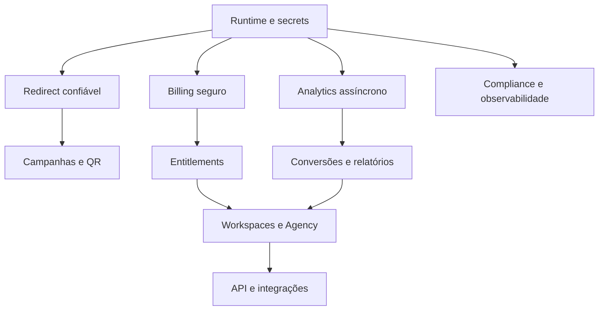

# MElink 10/10 — matriz de gaps e definição de prioridade

**Autor:** Manus AI  
**Data:** 26 de agosto de 2026  
**Base:** auditoria do código, produção publicada e benchmark de dez referências.

## 1. Resumo executivo

O MElink já possui uma base funcional com Laravel, Shlink, domínios customizados, billing inicial, analytics, QR nativo, fallback protegido e landing de marketing. A distância para um produto top não está em uma única feature; está na soma de confiabilidade, consistência de dados, profundidade de analytics, cobrança, colaboração, API e operação.

A correção deve seguir o risco. Gaps que afetam redirect, ownership, secrets, pagamento, backup e dados entram antes de expansão visual ou IA. O objetivo é fazer a promessa comercial e a capacidade operacional caminharem no mesmo passo.

## 2. Matriz principal

| ID | Área | Estado atual observado | Alvo top | Prioridade | Evidência de pronto |
|---|---|---|---|---:|---|
| G-01 | Redirect | Fallback Laravel protegido, mas arquitetura ainda depende do painel em alguns hosts | Edge/serviço de redirect isolado com cache e fallback controlado | P0 | Painel parado não interrompe slug; P95 e 5xx monitorados |
| G-02 | Runtime | Produção usa PHP CLI server e volumes montados | PHP-FPM/Nginx, processos separados e imagem imutável | P0 | Build reproduzível, healthcheck, graceful shutdown e zero bind de código |
| G-03 | Dados | Free/Premium e espelho local exigem reconciliação e integridade | Link, destino versionado, estado, campanha e workspace consistentes | P0 | Criação/edição/delete idempotentes com testes de concorrência |
| G-04 | Ownership | Ownership foi corrigido em partes, mas precisa virar padrão universal | Policy/repository obrigatório em todo recurso | P0 | Matriz de acesso cruzado verde para todas as rotas |
| G-05 | Quota | Janela de quota pode sofrer corrida e órfão remoto | Reserva atômica + idempotency + reconciliação | P0 | Teste concorrente não ultrapassa entitlement e órfãos são reconciliados |
| G-06 | Secrets | Seeder/histórico público teve credenciais tratadas como expostas | Secret manager, rotação e CI secret scan | P0 | Nenhum secret no Git/histórico ativo; rotação ensaiada |
| G-07 | Billing | Stripe tem base, mas estados/eventos e concorrência precisam endurecer | Event store único, máquina de estados e reconciliação | P0 | Replay, evento fora de ordem, falha e cancelamento testados |
| G-08 | Onboarding | Landing melhorada; primeiro link ainda precisa de wizard/ativação mensurável | Time to first link < 2 min, checklist e ajuda contextual | P0 | Teste de usuário e evento de ativação por coorte |
| G-09 | Analytics | KPIs e filtros iniciais; conversão/receita/exportação são limitados | Pipeline assíncrono, conversões, atribuição e relatórios | P1 | Evento versionado, dedupe, atraso visível e export seguro |
| G-10 | Domínios | Cadastro/TLS existem, mas estado/SSRF/TOCTOU precisam endurecer | DNS wizard, active-only, TLS job, alerta e isolamento por workspace | P0 | Domínio pendente não serve; renovação e rebinding testados |
| G-11 | QR | SVG local e download inicial | QR dinâmico PNG/SVG/PDF, branding e scan analytics | P1 | Contraste, download, edição de destino e scan separado |
| G-12 | Campanhas | UTM/tags foram adicionados ao premium | Campanha como entidade reutilizável e comparável | P1 | Template, filtros, duplicação sem eventos e relatório |
| G-13 | Conversões | Clique/analytics básicos | Lead, compra, receita, janela e consentimento | P1 | Evento assinado, idempotente, com moeda e origem |
| G-14 | Search/bulk | Lista funcional, mas sem operação em massa madura | Busca, filtros, pastas, bulk e CSV | P1 | 1.000 itens com progresso, retry e relatório |
| G-15 | Workspaces | Modelo inicial centrado em usuário | Organização, clientes, membros e RBAC | P1 | Owner/Admin/Editor/Viewer isolados e auditáveis |
| G-16 | Agency | Sem white-label e relatório de cliente completo | White-label, clientes, billing e suporte de agência | P1 | Agência opera três clientes sem cruzamento de dados |
| G-17 | API | Integrações internas; API pública ainda não é produto | API v1, OpenAPI, tokens, SDK e webhooks | P1 | Chave escopada, revogação, rate limit e exemplos |
| G-18 | Integrations | Poucos conectores e sem marketplace | Zapier/Make, GA, Shopify, WordPress e pixels consentidos | P2 | Instalação/uninstall e logs testados |
| G-19 | Security | Sessão/CSRF existem; 2FA, WAF, headers e anti-abuso precisam evolução | Defense in depth, MFA, abuse desk e pentest | P0 | Threat model, DAST autorizado, incident runbook e reteste |
| G-20 | Privacy | Necessita mapa, retenção, exclusão e consentimento formal | LGPD operacional por workspace | P0 | Export/delete, registro de consentimento e política publicada |
| G-21 | Observability | Request ID e health existem; SLO/alerta/status precisam formalização | Métricas, logs redigidos, traces, status e runbooks | P0 | Alertas acionáveis, dashboard e simulação de incidente |
| G-22 | Backup | Dump de banco validado; storage/config/certificados exigem cobertura | Backup completo e restore periódico | P0 | Restore banco + storage em ambiente efêmero |
| G-23 | QA | Suíte cresceu e testes focais passaram; cobertura de concorrência e contrato é insuficiente | CI com testes de produto e sintéticos públicos | P0 | Merge bloqueia regressão, secret, advisory e migration quebrada |
| G-24 | UX | Landing agora é profissional, mas painel precisa de coerência de produto | Design system, acessibilidade e estados úteis | P1 | Keyboard/screen-reader/contrast e jornada sem tela morta |
| G-25 | IA | Não deve ser prioridade imediata | Assistente para slug, UTM, insights e suporte com limites | P3 | Saída explicável, sem acesso amplo a dados e com auditoria |
| G-26 | Mobile | Não há MMP/deep linking completo | Regras web-to-app e SDK sob demanda | P3 | Caso real, privacy-safe e sem fricção no uso básico |

## 3. Gaps que bloqueiam venda imediata

Os bloqueios imediatos são G-02, G-03, G-04, G-06, G-07, G-08, G-10, G-19, G-20, G-21, G-22 e G-23. Eles não significam que a landing não possa receber tráfego orgânico controlado; significam que não é prudente prometer escala, cobrança recorrente, compliance ou disponibilidade enterprise antes de fechá-los.

## 4. Gaps que mais aumentam receita

Os itens que tendem a aumentar ticket são conversões/receita, workspaces, RBAC, Agency, white-label, exportação e API. QR visual, mini-hub e smart routing ajudam aquisição e retenção, mas não devem ultrapassar billing, analytics e operação na fila de prioridade.

## 5. Gaps que mais reduzem risco

Os itens que protegem reputação e caixa são secrets, ownership, redirect isolado, SSRF, abuso, backup/restore, Stripe idempotente, TLS active-only, dependências atualizadas e runtime imutável. Cada um deve ter teste de falha, não apenas implementação feliz.

## 6. Matriz de dependências

## 7. Regra de priorização

Se uma iniciativa melhora somente a aparência, mas não aumenta ativação, retenção, ticket ou confiança, ela perde para uma iniciativa que corrige integridade, medição ou operação. A única exceção é uma falha de UX que impede o primeiro valor. Produto top não é o que tem mais menu; é o que entrega mais resultado com menos incerteza.
